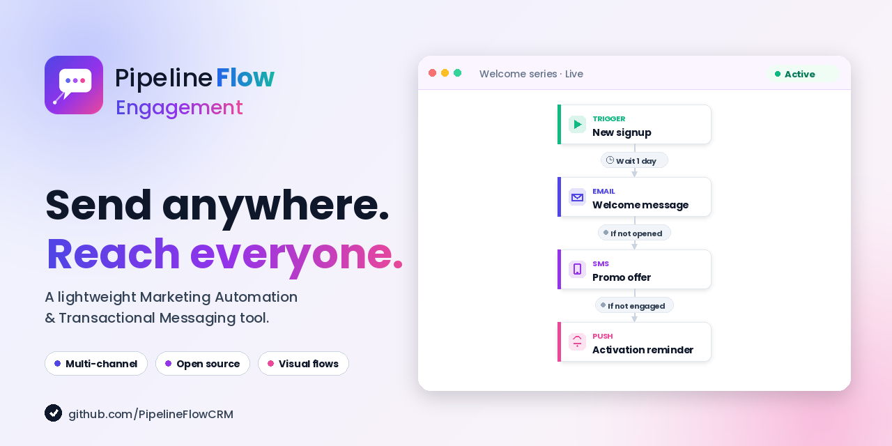

<p align="center">
  
</p>

# Pipelineflow Engagement

A self-hosted customer engagement platform — Segment.com-style event ingestion, JSON-tree audiences, MJML+Liquid email templates, broadcast sends, and a visual journey builder. Sister app to [PipelineFlow CRM](https://github.com/dispatchscout/pipeline-flow); ships standalone, or pairs with the CRM via SSO + HMAC-signed webhooks when both are installed.

> **Status:** early. Single-tenant by design — every signed-in operator shares one workspace and can edit every audience, template, broadcast, and journey. Multi-tenant / RBAC isn't on the near-term roadmap. Targeted at entrepreneurs and small teams self-hosting on Portainer; current design ceiling is ~50–100M events / 30 days warm with one Postgres+Timescale instance.

## Features

- **Segment.com-shape events** — `track`, `identify`, `page`, `screen`, `group`, `alias` over `POST /api/public/*`. Bearer-auth via personal API tokens. `messageId` is the idempotency anchor; replays are deduped on a separate (non-hypertable) `EventDedupe` table.
- **TimescaleDB-backed event store** — `Event` is a hypertable chunked daily, compressed after 7 days, retention by env var (default 365 days). Continuous aggregates pre-roll the most common audience-compute query shape.
- **Audiences** — JSON-tree definitions over `And` / `Or` / `Trait` / `Performed` nodes; compiled to parameterised Postgres SQL. Membership is materialised under a per-audience advisory lock and recomputed on a periodic BullMQ cron. Entered/exited deltas drive journey triggers (capped at 5000/pass to absorb trait-import storms).
- **MJML + Liquid email templates** — sandboxed render (no filesystem `include`, capped iterations), live preview endpoint that interpolates against sample subscriber traits. Templates require a subscription group; sends without one are blocked.
- **Broadcasts** — snapshot the audience at launch, fan out per-batch + per-send through a BullMQ pipeline with rate-limited send. Pause / resume / cancel at any point. Defense-in-depth re-checks `Suppression` and `SubscriptionState` at send time, not just at snapshot.
- **Visual journey builder** — drag-and-drop graph editor (xyflow + dagre auto-layout), with custom node components per type (EventEntry, SegmentEntry, Delay, Message, WaitFor, SegmentSplit, Exit). Configure each node from the side panel; save as draft, publish to bump a versioned `JourneyVersion`.
- **JourneyRunner** — per-subscriber state machine runs on BullMQ + Postgres. Each `JourneyRun` row holds `(currentNodeId, contextJson, scheduledFor, versionId)`; a delayed tick advances it. Three layers of idempotency: per-run advisory lock around the tick, deterministic BullMQ jobIds, and `Delivery.idempotencyKey` UNIQUE so a Message-node retry never double-sends. Run rows pin `versionId` so definition edits never break in-flight runs.
- **AWS SES** — SESv2 send, SNS-signed webhook handler with strict cert-URL allow-list and 15-minute replay window. Hard bounce / complaint auto-writes to `Suppression`; soft bounces stay in the lifecycle but don't suppress. Hourly quota poll surfaces send rate + sandbox-vs-prod status on the dashboard.
- **Subscription groups + preferences center** — public, no-auth `/p/preferences/:token` page over a long-lived signed-JWT (per-subscriber). Honours `List-Unsubscribe` / `List-Unsubscribe-Post` one-click. Token verification refuses to flip a subscriber into a group they were never sent into — leaked-token abuse path closed.
- **Deliverability alerts** — hourly rollup of bounce / complaint rates over 24h. Raises warning (3% / 0.05%) and critical (5% / 0.1%) `DeliverabilityAlert` rows with auto-resolve when metrics fall back below threshold. Active alerts banner the dashboard.
- **CRM bridge** — when paired with PipelineFlow CRM: SSO via short-lived HMAC JWTs, inbound webhook for contact + activity sync, and outbound delivery-lifecycle push so opens / clicks / unsubscribes show up on the CRM contact's timeline. Standalone install needs none of it.
- **Auth** — argon2id password hashing, DB-backed session cookies (httpOnly + SameSite=Lax), per-IP login rate limiting, CSRF via Origin/Referer check. Personal API tokens for events ingest are stored as Argon2 hashes; constant-time verification path even on unknown token id.
- **Operator audit log** — every broadcast launch, audience edit, template publish, secret set, GDPR delete is recorded with truncated args.

## Roadmap

Things we're considering next. Not commitments — order shifts as we learn what's actually painful in real use. Contributions welcome on any of these (open an issue first so we can agree on shape).

**Authoring**
- **emailo WYSIWYG** — port Dittofeed's ProseMirror-based rich-text email editor (currently we ship a code editor + live MJML preview, which is functional but is hostile to non-engineer authors). Drop-in replacement for the MJML pane; the rendered output is the same MJML.

**Channels**
- **SMS via Twilio** — clone the SES destination shape: provider-credentials in the encrypted `Secret` table, a sendSms helper paralleling `sendMail`, and inbound delivery webhooks. Templates gain an `sms` channel and a per-channel definition.
- **Push via FCM** — same shape, firebase-admin under the hood. Subscribers gain a `pushTokens` trait.
- **Generic webhook channel** — outbound HTTP POST as a "send", HMAC-signed; for back-office triggers and integrations that aren't email/SMS/push.

**Audience builder**
- **Manual audience nodes** — operator-curated lists (CSV import, hand-pick, "static membership"). Today's audiences are all rule-driven.
- **RandomBucket nodes** — split a parent audience into N deterministic buckets by hash of `subscriberId` (for cohort experiments and gradual rollouts).

**Journey builder**
- **RandomCohort node** — same primitive at the journey level; a percentage-based fork that's stable per subscriber across re-evaluations.
- **RateLimitNode** — cap throughput through a journey segment (e.g. "no more than 5 of these per minute").

**Broadcast intelligence**
- **A/B testing on broadcasts** — author N variants, pick a winner by open / click / conversion event over a chosen window, send the winner to the holdout.
- **Send-time optimization** — per-subscriber learned best-send-hour, queryable from any DelayNode (`localized-time` mode + a "user's best hour" knob).

**Deliverability**
- **Engagement-based suppression** — auto-suppress addresses that haven't opened in N consecutive sends, with a per-group threshold and a ramp-back path. The deliverability tile on the dashboard already shows the metrics; this would close the loop.

**Observability**
- **Real-time events ingest dashboard** — live Bull Board-style view of throughput / lag / error rate on the events ingest queue, plus a streaming "tail" of recent events so an integrator can debug their SDK without `psql`.

**Quality**
- **Vitest test suite** — golden-file SQL output for each audience-compiler combo, journey-runner idempotency guards, SES SNS signature roundtrip, preferences JWT rotation grace. The end-to-end smoke test (`scripts/smoke.sh`) covers the happy path; unit tests cover the algorithmic edges.

**Platform**
- **Off-host scheduled backups to S3** — extend the on-deploy `pg_dump` (which lands in a Docker volume) with a scheduled S3 push so dumps survive a host loss without a manual rsync step.
- **Public REST API + scoped tokens** — already in for ingest (`engagement:ingest` scope); broaden to read/write/admin scopes covering subscribers / audiences / templates / broadcasts so external systems can drive the platform.

## Stack

- **Backend** — Node 20 + Express + TypeScript, Prisma (PostgreSQL + TimescaleDB), argon2 password hashing, DB-backed sessions, Zod validation, helmet + tight CSP, `express-rate-limit`.
- **Background workers** — BullMQ on Redis 7. Producer in api, consumers in `apps/worker`. Bull Board mounted at `/admin/queues` (auth-required).
- **Frontend** — Vite + React 18 + TypeScript, React Router, TanStack Query, Tailwind + Radix primitives (shadcn-style), `@xyflow/react` + dagre journey builder, `sonner` toasts.
- **Database** — PostgreSQL 16 with the `timescaledb` extension. The `Event` table is a hypertable on `receivedAt` with chunked storage, compression policy, retention policy, and continuous aggregates for the audience-compute hot path.
- **ESP** — AWS SES (SESv2), with SNS-signed delivery webhooks. Render pipeline is MJML + Liquid (sandboxed).
- **Deploy** — `docker compose up -d --build` (one stack: postgres + redis + api + worker + web).

## Repo layout

```
pipeline-flow-engagement/
├── apps/
│   ├── api/          # Express API + Prisma schema + migrations
│   ├── worker/       # BullMQ workers (events / audiences / broadcasts / journeys / SES quota / deliverability)
│   └── web/          # Vite React SPA
├── packages/
│   └── shared/       # Zod schemas + queue names + journey/audience JSON shapes
├── assets/           # Logos + feature graphic
├── scripts/
│   └── smoke.sh      # End-to-end smoke test (10 steps, ~25s on a fresh DB)
├── docker-compose.yml
├── pnpm-workspace.yaml
└── package.json
```

## Local development

Requires Node 20+, pnpm 9+, and Docker (for Postgres + Redis).

```bash
# 1. Install dependencies
pnpm install

# 2. Generate secrets + write .env
cp .env.example .env
# Then fill in:
#   SECRET_ENCRYPTION_KEY=$(openssl rand -base64 32)
#   PREFERENCES_JWT_KEY=$(openssl rand -base64 64)
# Optionally:
#   CRM_SHARED_SECRET=$(openssl rand -base64 64)   # if pairing with PipelineFlow CRM

# 3. Start Postgres + Redis (postgres binds to 5440, redis to 6381 to avoid colliding with the CRM)
docker compose up -d postgres redis

# 4. Migrate
pnpm --filter @pipelineflow-engagement/api run prisma:migrate

# 5. (Optional) Seed default subscription groups + a demo admin
pnpm --filter @pipelineflow-engagement/api run prisma:seed

# 6. Run dev servers
pnpm dev
```

- Web: <http://localhost:5174>
- API: <http://localhost:4100>
- Login: `admin@example.com` / `changeme123` (created by the seed script — change immediately)

The Vite dev server proxies `/api` and `/p` → `http://localhost:4100`, so no CORS in dev.

## Production deploy

```bash
cp .env.example .env
# Edit .env. Required:
#   POSTGRES_PASSWORD            (do NOT ship the dev default)
#   APP_ORIGIN                   (your public URL, e.g. https://engagement.example.com)
#   SECRET_ENCRYPTION_KEY        (openssl rand -base64 32 — must decode to 32 bytes; AES-256-GCM key for the Secret table)
#   PREFERENCES_JWT_KEY          (openssl rand -base64 64 — HS256 key for preferences-center JWTs)
# If pairing with PipelineFlow CRM:
#   CRM_BASE_URL                 (e.g. https://crm.example.com)
#   CRM_SHARED_SECRET            (openssl rand -base64 64 — paired with the same value on the CRM side)
docker compose up -d --build
```

### Docker Compose Commands

```bash
docker-compose up      # creates and runs the stack (postgres + redis + api + worker + web)
docker-compose stop    # stops the containers
docker-compose start   # starts the containers
docker-compose down    # stops and removes the containers
docker-compose down -v # also removes the named volumes (DESTRUCTIVE — wipes data)
docker compose ps      # lists running containers + health
```

By default the published ports bind to `127.0.0.1` only. **You are expected to put a TLS-terminating reverse proxy (Caddy / Traefik / nginx) in front of the `web` service.** If you want to expose the containers directly on a trusted LAN without TLS, set `BIND_HOST=0.0.0.0` in `.env` and `SESSION_COOKIE_SECURE=false` so login cookies travel over HTTP.

The `web` container is nginx serving the React build and reverse-proxying `/api/*` and `/p/*` to `api:4100`. Postgres data lives in the named volume `pfengagement-pgdata`. Default port assignments are shifted off PipelineFlow CRM's defaults so both stacks can co-exist on one host (CRM uses 5439/6380/4000/5173; Engagement uses 5440/6381/4100/5174).

**Migrations run automatically** on every `api` container start (`apps/api/scripts/start.sh` runs `prisma migrate deploy` before binding the HTTP port). The `worker` service depends on `api: { condition: service_healthy }` so cron jobs don't fire before the schema exists.

### Portainer (stack from Git)

The compose file builds the `api`, `worker`, and `web` images from source (no pre-built images on a registry), so the natural Portainer path is **Stacks → Add stack → Repository**:

1. **Name** — e.g. `pfengagement`.
2. **Build method** — *Repository*.
3. **Repository URL** — the Git URL of this project. Add credentials if it's private.
4. **Reference** — the branch you want to track, e.g. `refs/heads/main`.
5. **Compose path** — `docker-compose.yml`.
6. **Environment variables** — *Advanced mode*, paste your filled `.env`. At minimum:
   - `POSTGRES_PASSWORD` (required — the compose file refuses to start without it)
   - `APP_ORIGIN` (your public URL)
   - `SECRET_ENCRYPTION_KEY` (32 raw bytes, base64-encoded)
   - `PREFERENCES_JWT_KEY` (any sufficiently random string)
   - Optional: `BIND_HOST`, `WEB_PORT`, `API_PORT`, `POSTGRES_PORT`, `REDIS_PORT`
   - Optional CRM bridge: `CRM_BASE_URL`, `CRM_SHARED_SECRET`
7. **GitOps updates** *(recommended)* — enable *Automatic updates* with polling or a webhook; a `git push` triggers rebuild + redeploy. Migrations run automatically on `api` start.
8. **Deploy the stack.**

After it's up, run the seed once if you want default subscription groups + a demo admin from Portainer's container console for `pfengagement-api`:

```bash
pnpm prisma:seed
```

Notes:

- **Removing the stack with "Remove volumes" enabled deletes the database.** Take a `pg_dump` first (see [Backups](#backups)).
- **Need to attach the `web` container to an external proxy network?** Don't bake the network name into `docker-compose.yml` — keep that override local. Create `docker-compose.override.yml` (gitignored) with the network attachment, then point Portainer's *Compose path* at both files (e.g. `docker-compose.yml,/srv/pfengagement/docker-compose.override.yml`).

### Reverse proxy

Set `APP_ORIGIN` in `.env` to your public URL — the API uses it for the CORS allow-list, the cookie domain, the Origin/Referer CSRF check, AND to construct the unsubscribe-link URL injected into every email. If you mis-set it, `{{ unsubscribe_url }}` in your templates will resolve to the wrong host.

## Backups

Every time the `api` container starts with **pending Prisma migrations**, it takes a gzipped `pg_dump` to the `pfengagement-backups` Docker volume *before* applying them. Plain restarts (no schema change) skip the dump, so the volume doesn't accumulate empties.

The dump runs as part of `apps/api/scripts/start.sh`. If the dump fails, the container exits non-zero and the migration does **not** run.

Files are named `pfengagement-<UTC-ISO>-pre-migrate.sql.gz` and are auto-pruned after `BACKUP_RETAIN_DAYS` days (default 30).

> **Timescale note.** A dump from a Timescale-extended database needs the `timescaledb` extension on the target cluster to restore the `Event` hypertable. Since `docker-compose.yml` pins `timescale/timescaledb:latest-pg16`, restoring back into a vanilla `postgres:16-alpine` won't work — restore into the same image.

```bash
# Listing backups
docker compose exec api ls -lh /backups

# Pulling backups off the host
docker compose cp api:/backups ./backups-copy

# On-demand backup (no migration required)
docker compose exec postgres pg_dump -U pfengagement pfengagement | gzip > backup.sql.gz

# Restoring
gunzip -c backup.sql.gz | docker compose exec -T postgres psql -U pfengagement pfengagement
```

To make backups survivable across a host loss, either bind-mount the `pfengagement-backups` volume to a host path you already back up (uncomment the driver block in `docker-compose.yml`) or rsync the directory off-host on a cron.

## Auth

Session cookies (httpOnly, SameSite=Lax) backed by a `Session` table in Postgres. Sessions live 30 days, with `lastSeenAt` updated lazily. CSRF is handled with an Origin/Referer header check on every mutating request. Login + register are rate-limited per IP (default: 10 attempts / 5 min — `RATE_LIMIT_LOGIN_MAX` / `RATE_LIMIT_WINDOW_MS`).

Password hashing is **argon2id**. The login route runs a constant-time dummy verify on unknown emails so timing can't reveal account existence.

## API tokens (events ingest)

Engagement is a "data lands here" platform — the events surface (`POST /api/public/{track,identify,page,screen,group,alias,batch}`) is the obvious integration point. It's bearer-auth via personal API tokens.

### Issue a token

1. Sign in to the web app and go to **Settings → API tokens**.
2. Click **New token**, give it a name, pick scopes (`engagement:ingest` for events ingest; `engagement:read` / `engagement:write` / `engagement:admin` are reserved for upcoming surfaces).
3. The plaintext token is shown **once** in the format `pfe_tok_<id>.<secret>`. Copy it — only the Argon2id hash is stored on the server.

Tokens are personal and revocable from the same page. The `pfe_` prefix is grep-recognisable in logs and distinct from the CRM's `pf_` prefix so a leak can be triaged to the right system.

### Send events

```bash
TOKEN="pfe_tok_xxxx.yyyyyyyy"

# Identify a subscriber + set traits
curl -X POST https://engagement.example.com/api/public/identify \
  -H "Authorization: Bearer $TOKEN" \
  -H "Content-Type: application/json" \
  -d '{"userId":"u_42","traits":{"email":"jane@acme.test","plan":"pro","timezone":"America/Los_Angeles"}}'

# Track a behavioural event
curl -X POST https://engagement.example.com/api/public/track \
  -H "Authorization: Bearer $TOKEN" \
  -H "Content-Type: application/json" \
  -d '{"userId":"u_42","event":"completed_onboarding","properties":{"stepCount":7}}'

# Batch up to 500 events in one round-trip
curl -X POST https://engagement.example.com/api/public/batch \
  -H "Authorization: Bearer $TOKEN" \
  -H "Content-Type: application/json" \
  -d '{"batch":[ {"type":"track","userId":"u_42","event":"opened_email"}, ...]}'
```

The wire format mirrors the [Segment.com HTTP API](https://segment.com/docs/connections/sources/catalog/libraries/server/http-api/) — any Segment-compatible client SDK targets the same endpoints with `Authorization: Bearer <token>`.

`messageId` (caller-supplied or server-generated UUID) is the idempotency anchor: a replay returns 202 but the second insert is a no-op. `observedAt` (caller's clock) is clamped to ±24h around the server clock; `receivedAt` is server-set so a misbehaving SDK can't backdate events into compressed Timescale chunks.

## CRM bridge

Pipelineflow Engagement is a sister app to **PipelineFlow CRM** — the bridge is opt-in and detected via `CRM_BASE_URL` in `.env`. Unset → CRM features are disabled, the engagement app runs standalone. Set → four hooks light up:

- **Shared auth (SSO).** The CRM mints a short-lived (15 min) HMAC-HS256 JWT and redirects to `${ENGAGEMENT_BASE_URL}/auth/sso?token=…`. Engagement verifies, mints its own session cookie. No DB sharing.
- **CRM contacts → Engagement subscribers.** CRM webhooks Engagement at `POST /api/public/webhooks/crm` (HMAC-verified, replay-protected). Engagement upserts the subscriber keyed on `externalId = crm:contact:<id>`, source-tagged `crm`.
- **CRM activity events → Engagement events.** Same webhook channel, different payload shape (`deal.stage_changed`, `task.overdue`, etc.) → enqueued as `track()` events. Journeys can use these as `EventEntry` triggers.
- **Engagement deliveries → CRM activity timeline.** Every terminal Delivery state change (sent / delivered / opened / clicked / bounced / complained / unsubscribed / failed) for a `crm:contact:*` subscriber pushes to `${CRM_BASE_URL}/api/public/engagement-activity`. The CRM-side worker filters `source='crm'` events to break loops.

`CRM_SHARED_SECRET` is shared between the two apps and used for both the SSO JWT and the bidirectional webhook HMACs. Generate once with `openssl rand -base64 64` and paste into both stacks' `.env`.

## AWS SES

Engagement sends through AWS SES via the SESv2 API. Configure once via **Settings → Secrets / SES**:

1. Create an IAM user with the `AmazonSESFullAccess` policy (or the minimal subset: `ses:SendEmail`, `ses:GetAccount`, `ses:GetSendQuota`).
2. In the SES console, verify the sending domain (and add the SES-provided DKIM CNAMEs to your DNS).
3. Configure an SNS topic for delivery notifications, point it at `https://engagement.example.com/api/public/webhooks/amazon-ses`, and subscribe the SES Configuration Set to the topic for the events you want (Delivery, Bounce, Complaint, Open, Click, Reject).
4. In the Engagement UI, paste the IAM credentials + region. They're encrypted at rest with AES-256-GCM (`SECRET_ENCRYPTION_KEY`) before storage.

The `engagement-ses-quota-poll` worker runs every 60s and writes the live `Setting('ses.quota')` snapshot, which the dashboard reads. Production-access status, max-24h, max-send-rate, and last-24h-sent all surface there.

Hard bounces and complaint notifications auto-write to `Suppression` (checked before every send, irrespective of `SubscriptionState`). The SNS handler has a 15-minute Timestamp freshness check + a strict cert-URL allow-list (`^sns\.[a-z0-9-]+\.amazonaws\.com$`) — replayed or spoofed webhooks are rejected.

## Preferences center

Every email rendered through the Engagement template pipeline auto-gets:

- A `{{ unsubscribe_url }}` Liquid variable bound to a long-lived (1y), signed-JWT-tokenized URL on `${APP_ORIGIN}/p/preferences/<token>`.
- `List-Unsubscribe` and `List-Unsubscribe-Post: List-Unsubscribe=One-Click` headers — required by Gmail / Apple Mail / Yahoo for sender reputation in 2024+.

The preferences-center page is public (no auth) but rate-limited per IP. Toggling subscriptions verifies that the subscriber has actually been sent into the target group — a leaked token can't be abused to opt the subscriber into arbitrary groups they were never targeted from.

Refusing to render an email without a `subscriptionGroupId` on the template is a hard guardrail at the worker level — a misconfigured template fails loudly, never silently sends without an unsubscribe link.

## Background workers

Long-running work (events ingest, audience compute, broadcast send, journey ticks, SES quota poll, CRM activity push, deliverability rollup, wait-sweep, stuck-run sweep) runs in `apps/worker` so it can't block the api event loop. Producers live in the api (`apps/api/src/lib/queue.ts`); consumers are dedicated processors under `apps/worker/src/jobs/`.

- **Broker** — Redis 7. `--maxmemory-policy noeviction` is mandatory: any other policy can silently lose queued jobs.
- **Concurrency** — set `WORKER_CONCURRENCY` (default 5) in `.env`. The worker's Prisma `DATABASE_URL` is configured with `?connection_limit=10` so Postgres pool doesn't starve under fanout.
- **Visibility** — Bull Board mounted at `/admin/queues` on the api (auth-required, gated by `BULL_BOARD_ENABLED`).
- **Dependency order** — `worker` waits on `api: { condition: service_healthy }` so cron jobs (wait-sweep, stuck-run sweep, deliverability rollup) don't fire before migrations run.

### Smoke test

`scripts/smoke.sh` walks the full Phase 1+2+3 happy path against a freshly-booted stack — health checks, register admin, mint API token, ingest 50 identify + 30 track events, recompute an audience and assert membership matches expected, author + render a template, create a broadcast in draft, verify schema invariants.

```bash
docker compose up -d
bash scripts/smoke.sh
```

Completes in ~25s on a clean volume. Useful as a deploy validation.

## Schema notes

- **`Event` is a Timescale hypertable**, partitioned on `receivedAt` with daily chunks, compressed after 7 days, retention default 365 days. Two continuous aggregates (`events_daily_by_subscriber`, `events_daily_by_name`) pre-roll the most common audience-compute queries.
- **`EventDedupe`** is the off-hypertable companion — `messageId TEXT PRIMARY KEY`. Timescale forbids unique indexes on a hypertable that don't include the partition key, so we moved dedup off-table; the events ingest worker inserts here first via `ON CONFLICT DO NOTHING`, then the Event row.
- **`Delivery.idempotencyKey UNIQUE`** anchors send-side idempotency. `bd:<broadcastDeliveryId>` for broadcasts, `jr:<journeyRunId>:<nodeId>` for journey Message nodes. A retry of the BullMQ send job short-circuits on the existing row instead of double-sending.
- **`JourneyRun` rows pin `versionId`** so a journey definition edit never disrupts in-flight runs. The runner advances under a per-run advisory lock (`pg_try_advisory_xact_lock(LOCK_NS.journeyRun, hashtext(runId))`) so concurrent ticks serialise.

## Available scripts

Run from the workspace root (host). Inside the `api` container only the api package is loaded, so use the `prisma:*` script names directly there (e.g. `docker compose exec api pnpm prisma:seed`).

| Command | Description |
| --- | --- |
| `pnpm dev` | Run api + worker + web concurrently |
| `pnpm build` | Build all packages |
| `pnpm db:migrate` | Apply Prisma migrations |
| `pnpm db:seed` | Seed default subscription groups + demo admin |
| `pnpm db:studio` | Open Prisma Studio |
| `pnpm lint` | Type-check all packages |
| `pnpm test` | Run Vitest unit tests |
| `bash scripts/smoke.sh` | End-to-end happy-path smoke test against a running stack |


## Testing with the demo

1. Mint a token in Settings → API tokens scoped only to engagement:ingest. The token value lands in browser source — treat it as semi-public.
2. Drop the snippet from the top of pfe/v1.js into your site's <head>, replacing data-write-key and data-api-host.
3. The first pageview fires automatically. Call pfe.identify('u_42', { email: '…' }) after login and pfe.track('signed_up', { plan: 'pro' }) for events. pfe.reset() on logout.

Demo page at apps/web/public/pfe/demo.html, served at https://<your-engagement-host>/pfe/demo.html once the web container restarts (Vite copies public/ into the nginx static root at build time, so a docker compose build web && docker compose up -d web is what picks it up). This is temporary and wont be part of the final release packages.

What it does

- Loader card — paste write key + API host (defaults to the page's own origin), toggle auto-pageviews and debug, click Load widget. Only inserts the <script src="v1.js"> after the click, so you can paste your token without it leaking before you mean it to.
- Identity status — shows anonymousId and userId from the widget's localStorage-backed state, with a refresh button.
- identify — userId + email + plan + timezone form.
- track — three preset buttons (clicked_cta, added_to_cart, started_checkout) with realistic property shapes, plus a custom event input with a JSON properties textarea.
- page — manual pfe.page(name), plus three SPA-nav buttons that history.pushState('?view=…') to demonstrate the auto-page hook firing on pushState.
- group / alias / reset — full surface, with reset clearly marked danger.
- Activity log — every demo action and any errors are appended at the bottom; for the actual outbound HTTP, watch DevTools → Network filtered on /api/public/.

Once you have a token: open the page, paste pfe_tok_… + your engagement host, click load, then poke buttons — the initial pageview fires automatically, and every other action goes out as a separate POST /api/public/<type> request you can inspect in the browser.

## Contributing

Issues and PRs welcome. See [CONTRIBUTING.md](./CONTRIBUTING.md) for build conventions, test expectations, and PR guidelines.

## License

[Mozilla Public License 2.0](./LICENSE).